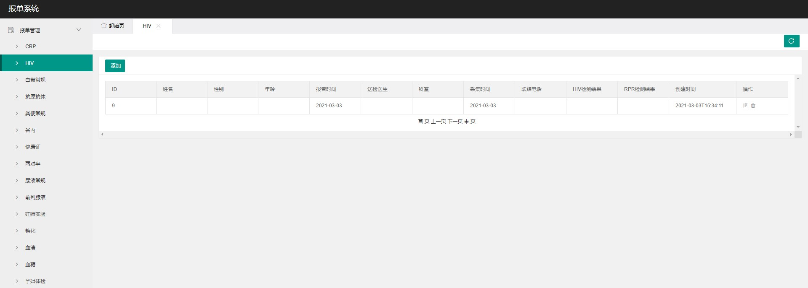
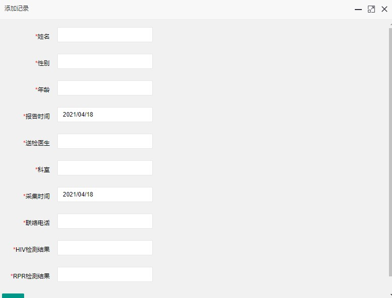
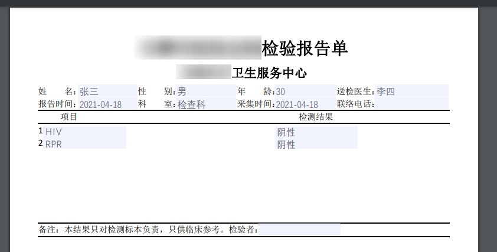

# 医院简易报单系统

基于 Spring Boot + Spring Data JPA + Thymeleaf + X-admin + iText 快速开发的一套医院简易报单系统。

## 项目背景

原来医院的医务工作人员对于患者检测信息的录入和打印都是基于 Word 文档进行，操作重复且需要反复调整格式，增加了日常工作的负担。

本项目按照要求实现了患者信息的录入存储和 PDF 页面输出，目的在于减轻医务工作人员的工作负担。

## 功能预览

### 界面展示

### 检测信息录入

### PDF 页面输出

## 启动方式

根据项目 sql 目录下的脚本文件创建 hospital 数据库，修改 Spring Boot 配置文件中的数据库连接地址，启动该项目，访问 `http://localhost:8888/` 查看系统主页面。
